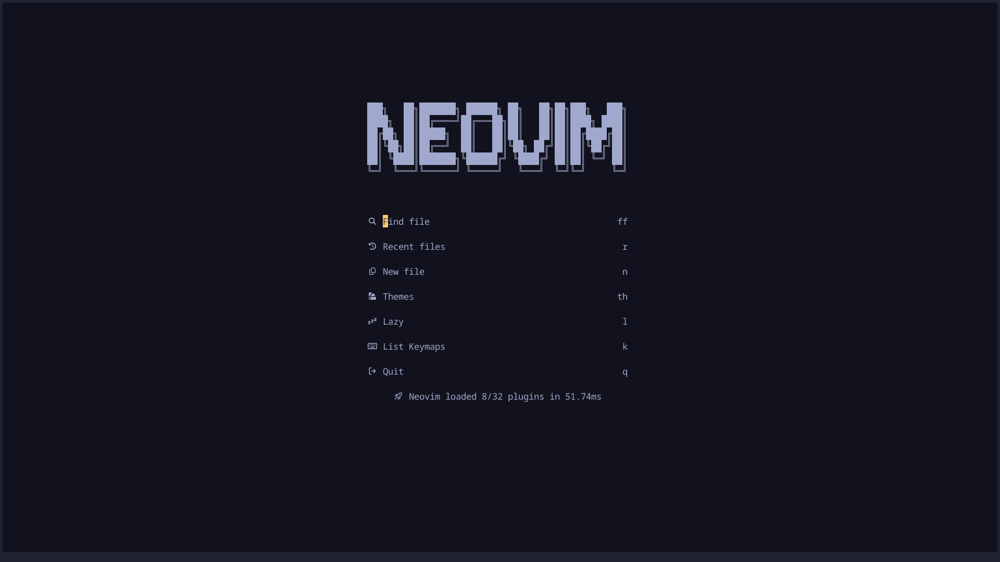
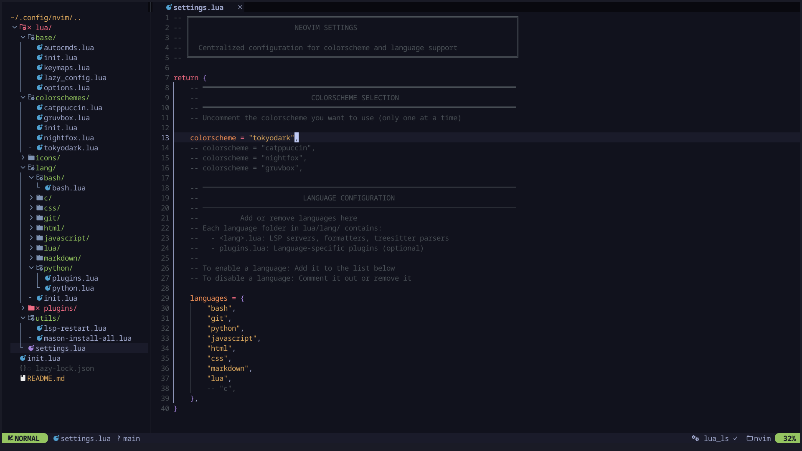

## Showcase




## Setup

#### required packages

```
neovim python3-pip gcc make nodejs wl-clipboard luarocks tree-sitter-cli
```

#### install

```bash
mv ~/.config/nvim ~/.config/nvim.bak
```

```bash
git clone https://github.com/sabamdarif/mynvim.git ~/.config/nvim && nvim
```

## Acknowledgments:

- [NvChad](https://github.com/NvChad/NvChad)
- [LazyVim](https://github.com/LazyVim/LazyVim)
